**Fintech Dashboard**

> [!NOTE]
> Quick summary: Angular based operations dashboard for managing customers, wallets, and transactions. Includes dashboard, customer CRUD flows, wallet limit updates, transaction filters, TR/EN i18n, and global error/toast handling.

> [!IMPORTANT]
> Minimum line coverage target: 80%+

**Features**
- Dashboard cards (total customers, active rate, age stats, KYC distribution)
- Latest updated customer card with quick detail navigation
- Customer list with search, KYC/active filters, pagination, delete flow
- Customer detail with wallet limit update and transaction list + filters
- Customer create/edit forms with validations
- Skeleton loading states for lists, cards, and forms
- TR/EN translations and toast notifications
- Light/Dark theme with localStorage persistence

**Architecture Highlights**
- Lazy loaded routes with standalone components for faster initial load
- Feature based structure with shared UI components and typed models
- Clear separation of concerns: HTML templates, SCSS styles, and TS logic
- Centralized API client and interceptors for loading and error handling

**Tech Stack**
- Angular (standalone)
- RxJS
- NgRx (store, effects)
- ngx-translate (TR/EN)
- Tailwind + SCSS (tokens, utilities)
- ngx-toastr
- Vitest

**Setup**
1. `npm install`
2. `npm start`

App runs at `http://localhost:4200`.

**Scripts**
- `npm run start:stage`
- `npm run build`
- `npm run build:stage`
- `npm run watch`

**Environment Configuration**
API and language settings are in:
- `src/environments/environment.ts`
- `src/environments/environment.stage.ts`
- `src/environments/environment.prod.ts`

Config keys:
- `apiBaseUrl`
- `defaultLanguage`

**Routes**
- `/dashboard`
- `/customers`
- `/customers/new`
- `/customers/:id`
- `/customers/:id/edit`

Customer list filters are synced to query params: `search`, `kycStatus`, `isActive`, `page`.

**Architecture**
- `src/app/core`: API client, interceptors, services (error, loading, theme, toast)
- `src/app/features`: feature screens and NgRx state
- `src/app/shared`: reusable UI, models, utilities
- `src/assets/i18n`: language files (TR/EN)
- `src/styles`: SCSS tokens, typography, utilities, dashboard styles

Path aliases:
- `@core/*`
- `@features/*`
- `@shared/*`

**API Endpoints**
Base URL is provided by environment config.
- `GET /api/customers`
- `GET /api/customers/:id`
- `POST /api/customers`
- `PUT /api/customers/:id`
- `DELETE /api/customers/:id`
- `GET /api/wallets/:customerId`
- `PATCH /api/wallets/:customerId`
- `GET /api/transactions/:customerId`

**Unit Tests and Coverage**
Run tests with coverage (default):
```bash
npm test
```

Run tests only:
```bash
npx vitest --run
```

Generate coverage only:
```bash
npx vitest --run --coverage
```

Read coverage summary from CLI:
```bash
node -e "const s=require('./coverage/coverage-summary.json'); console.log('Lines:', s.total.lines.pct + '%'); console.log('Statements:', s.total.statements.pct + '%'); console.log('Branches:', s.total.branches.pct + '%'); console.log('Functions:', s.total.functions.pct + '%');"
```

Fail CI if line coverage is below 80%:
```bash
node -e "const s=require('./coverage/coverage-summary.json'); const pct=s.total.lines.pct; console.log('Lines:', pct + '%'); process.exit(pct>=80?0:1);"
```

Coverage output:
- `coverage/`

---

**Screenshots**
Dashboard (Light)
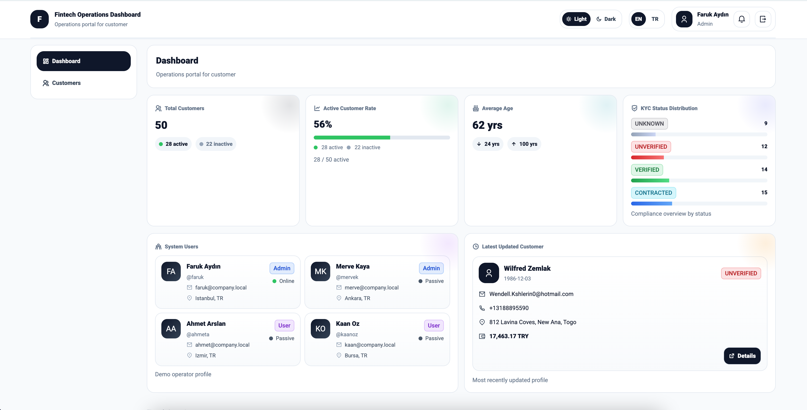

Dashboard (Light - Skeleton)
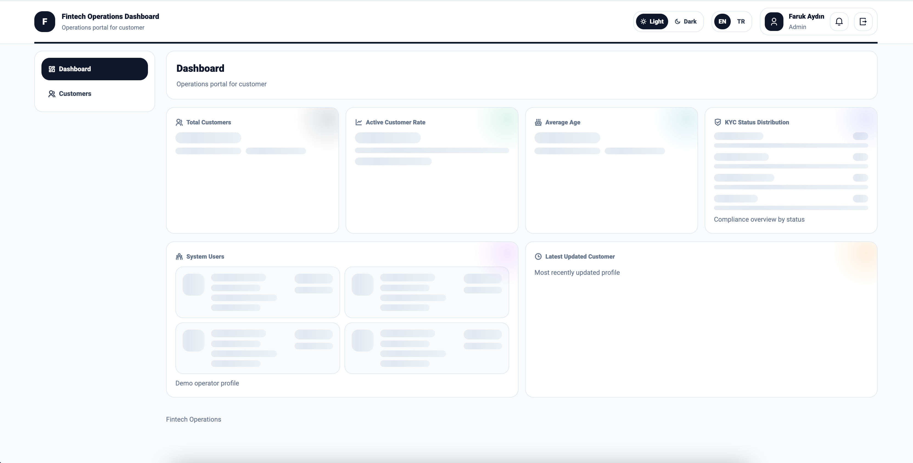

Dashboard (Dark)
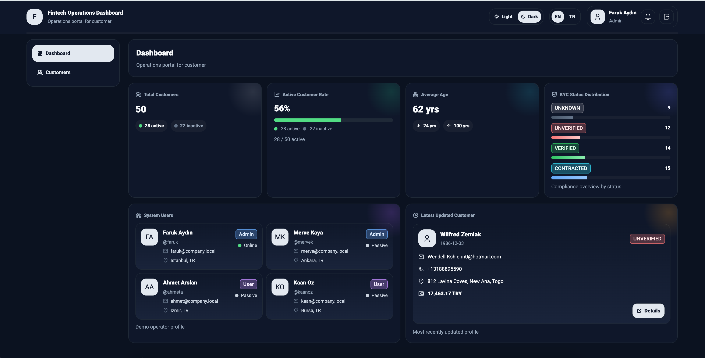

Customers List (Light)
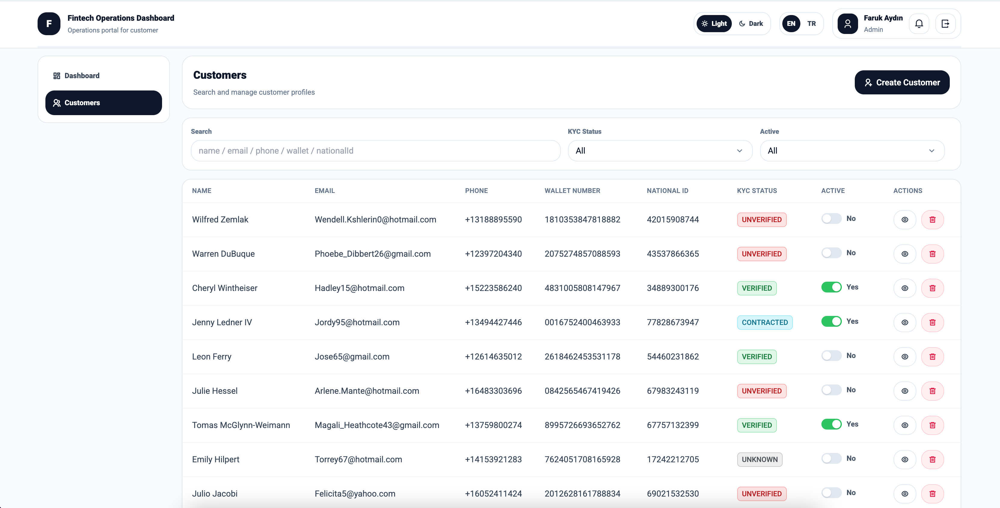

Customers List (Dark)
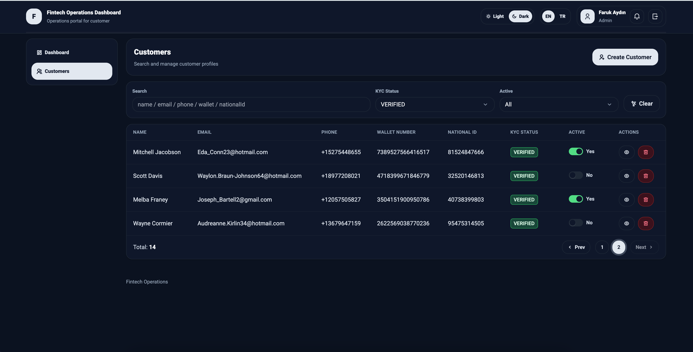

Create Customer (Light)
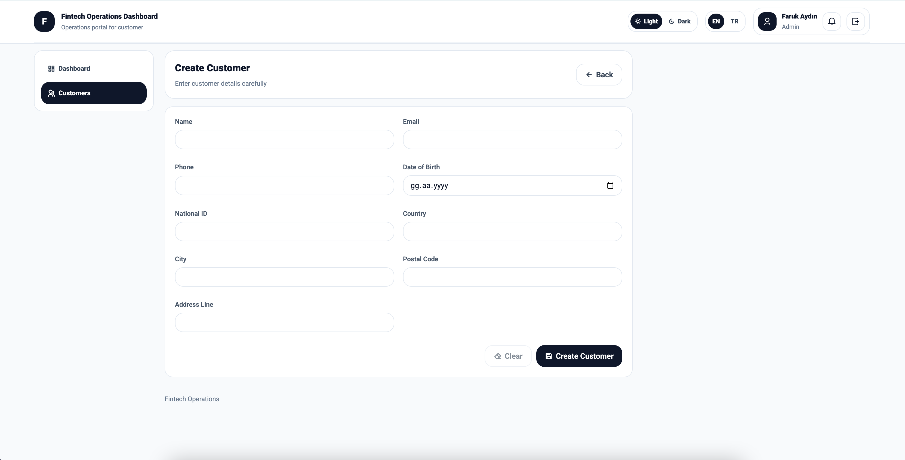

Edit Customer (Light)
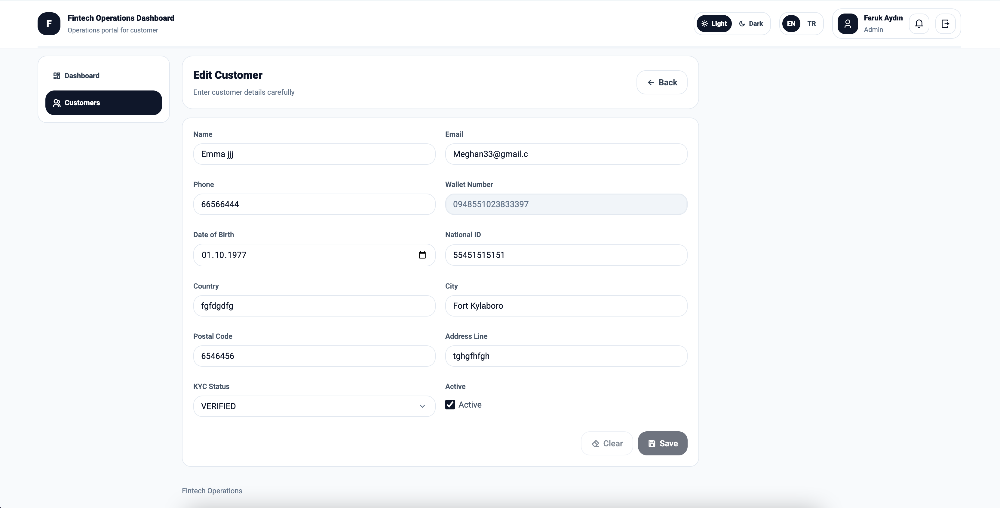

Edit Customer (Light - Validation)


Edit Customer (Dark - TR)
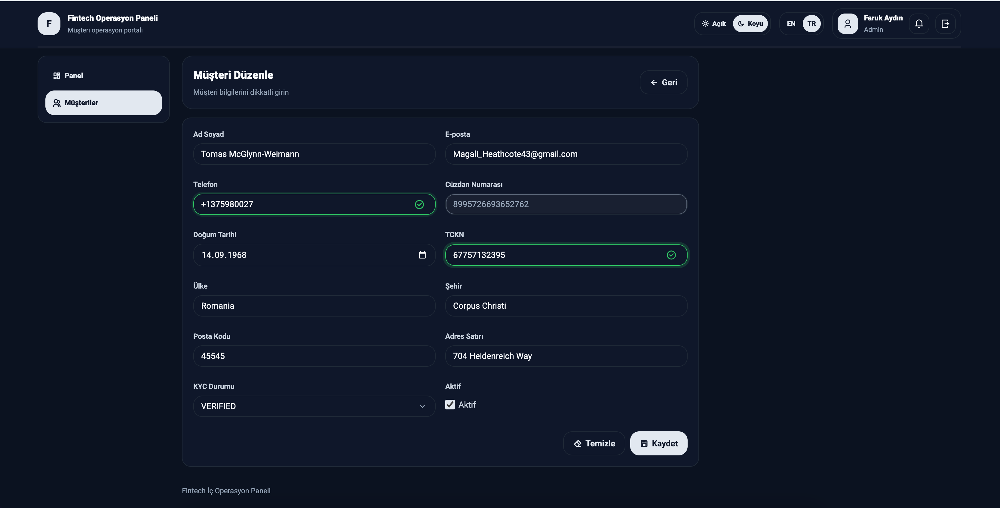

Customer Detail (Light - TR)
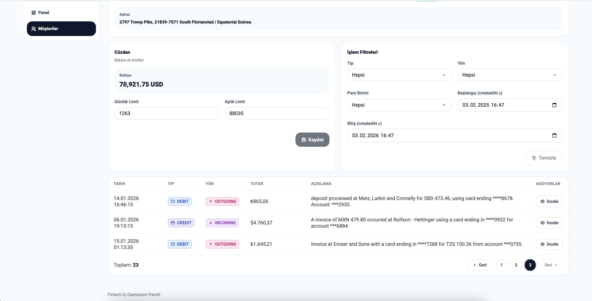

Customer Detail (Dark - TR)
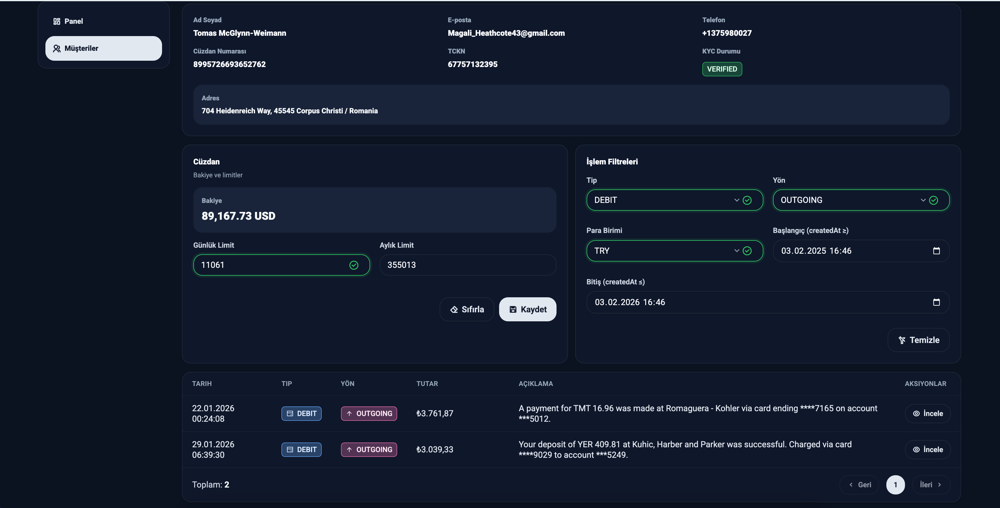

Delete Customer Modal (Dark - TR)
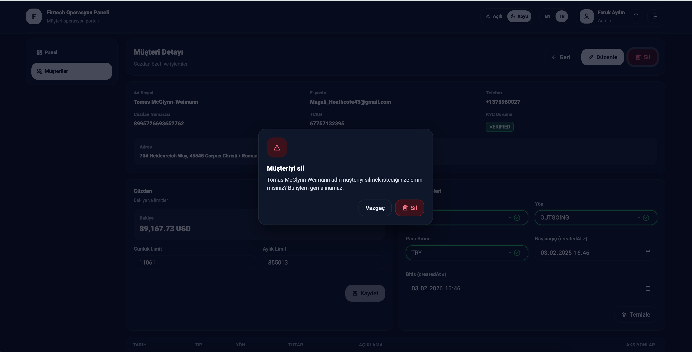
